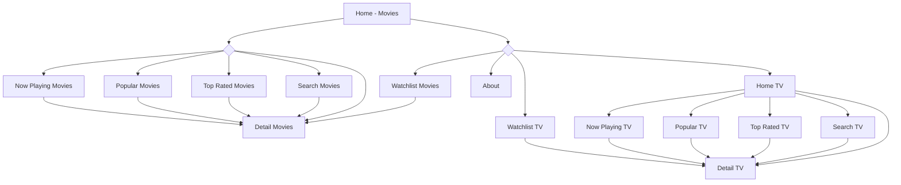

# Ditonton


CI Status: [](https://codemagic.io/app/6793c8a43e403087c73183b0/default-workflow/latest_build)

Ditonton is an entertainment application that allows users to explore their favorite either movies or TV series. Explore and favorite it!  

> **Project Type**: Course Assignment (Personal Project)  
>  
> **Development Date**: January 2025  
>  
> **Role**: Mobile Developer (Multi Platform)  

## Technologies Used  

  

This application was developed using Git, GitHub, Android Studio, Firebase, and Flutter as the primary framework.  


## Challenges - Solutions - Impact  

The development of this application faced several challenges, including continuing code that previously only had a movies feature, implementing modularization, transforming state management from Provider to BLoC, performing unit and widget tests, understanding user behavior demographics, detecting crashes in the application, and implementing Continuous Integration.  

### Challenges  

- Interacting with APIs and displaying data from APIs.  
- Developing existing code.  
- Separating into multiple modules/packages.  
- Transforming state management to be more reactive.  
- Building scalable and maintainable code for future development.  
- Understanding user behavior demographics.  
- Detecting crashes when the application is publicly used.  
- Implementing CI for automation.  

### Solutions  

- Using the `http` dependency to interact with APIs.  
- Implementing clean architecture with dependency injection using `get_it`.  
- Applying existing patterns to maintain code consistency.  
- Implementing unit, page, and widget tests to ensure code functions correctly.  
- Implementing Firebase Analytics for real-time demographic reports.  
- Implementing Firebase Crashlytics for crash reports when users experience issues.  
- Using Codemagic for Continuous Integration.  

### Impact  

- The application requires an internet connection since data is not stored in a database.  
- The application presents movie and TV series information effectively.  
- The application is scalable and can be further developed.  
- User demographics and crash history can be monitored through the Firebase console.  
- Automated testing is triggered upon repository push.  

## Lesson Learned  

From this project, I learned about using Flutter as an application framework. This application taught me how to interact with APIs, build applications using clean architecture, implement Firebase, conduct unit, page, and widget tests, and apply Continuous Integration.  

- Improved my understanding of Flutter.  
- Helped me understand API interactions.  
- Helped me understand state management with BLoC and dependency injection using `get_it`.  
- Helped me understand Firebase Analytics and Crashlytics.  
- Helped me understand CI with Codemagic in Flutter.  

# **Installation & Usage Guide**  

Installing and using this application is simple and quick. Users can follow the steps below to get started.  

## Installation  

The installation process involves several basic steps to ensure the application runs smoothly on the user’s device.  

To get started with Ditonton, follow these steps:  

1.  **Clone the repository**:  
    ```sh  
    git clone https://github.com/faradaii/ditonton.git  
    ```  
2.  **Navigate to the project directory**:  
    ```sh  
    cd ditonton  
    ```  
3.  **Install dependencies**:  
    -   If using Android Studio or VS Code:  
        Open **Terminal** and **Run** this command.  
        ```sh  
        flutter pub get  
        ```  
    -   For other environments, please refer to the specific setup instructions.  

4. **Get a new API key**:  
    - Obtain a new API key from [TMDB](https://www.themoviedb.org/) and replace the API key in the package `core > lib > common > constants.dart` if necessary.  

5. **Run the application**:  
    - In Android Studio or VS Code:  
        Select an emulator or physical device > click the **Run** button (or press Shift + F10).  
    - For other environments, follow the appropriate instructions.  

## Usage  

This application is easy to use. Users are directly taken to the movies' home page. They can navigate through different sections using the drawer.  




----------  
